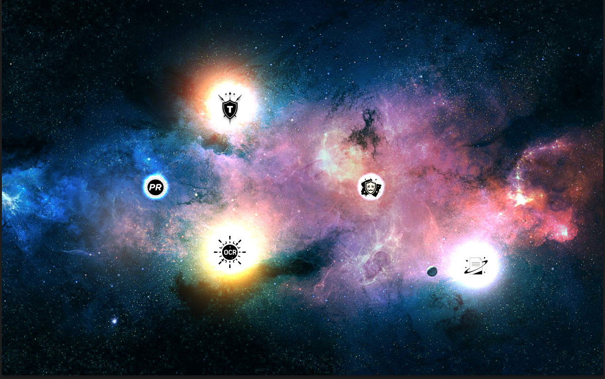
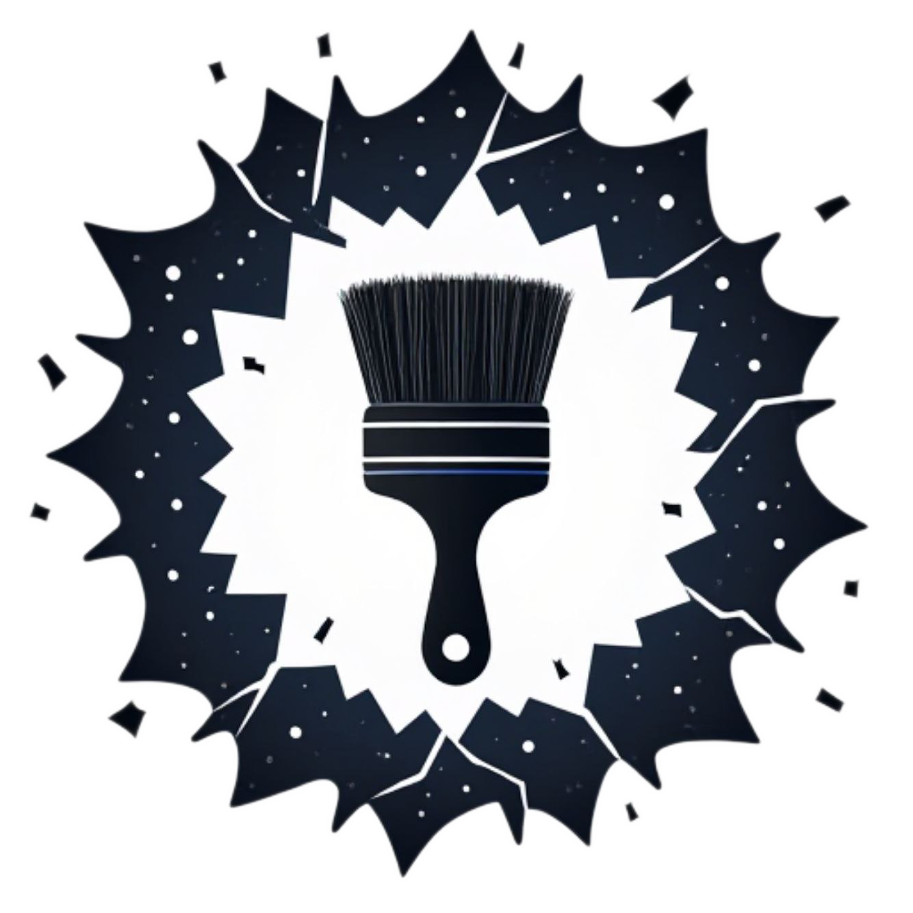

# Projects

👋 Hey!

My goal is to craft valuable tools: transparent, intuitive, and handy. Technology for good! 🚀

  
Free projects:

-  `Faster OCR`: image to text - get text from image/PDF.
 Published: , .

-  `True Paper`: turns your image into something that looks like real paper by eliminating shadows, distortions and blur - better for printing!
 Published: , .

-  `Text Maskifier`: hides text in image.
 Published: , .

-  `Face Maskifier`: hides faces in image.
 Published: , .

-  `No BG`: removes background from image.
 Published: , .

-  `My Cleaner`: clear unwanted areas from image.
 Published: , .

-  `Faster PR`:  extension aimed at speeding up the Pull Request process of developers for GitHub/GitLab/Trello/Jira/Monday.
 Published: , .

  
Details

 Speed up the process of creating pull requests from issues that can be found on `Github [github.com, github.any-name.com]`, `GitLab [gitlab.com]`, `Trello [trello.com]`, `Jira [jsw.any-name.com, jira.any-name.net]`, `Monday [monday.com, any-name.monday.com]` with a plugin that automatically generates branch names, commits, and PR descriptions in just one or two clicks. Additionally, this plugin can be customized to use your own templates. The plugin is shown in issue and pull request pages.

💡 These plugins are also supported in the Brave browser ! Simply open the [Chrome Web Store](https://chromewebstore.google.com) in Brave and install them as usual 😎.

## <a href="https://ko-fi.com/stellarexplorerguy">Become a Sponsor</a> 

> https://ko-fi.com/stellarexplorerguy

Your tips make a big difference - they boost the quality of tools and give me the confidence to keep current projects going and take on new ones! 🌱

Much appreciated! 🙌

  

🛠 Want to suggest an improvement or report a bug? [Submit an issue here.](https://github.com/StellarExplorerGuy/projects/issues/new/choose)

