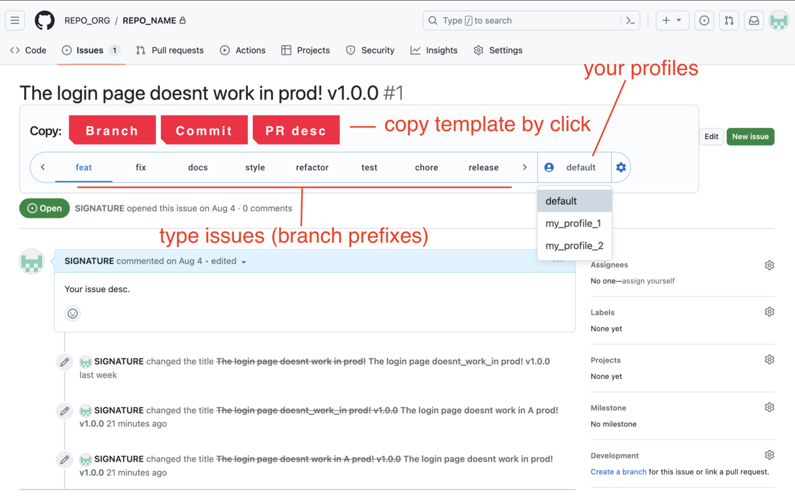
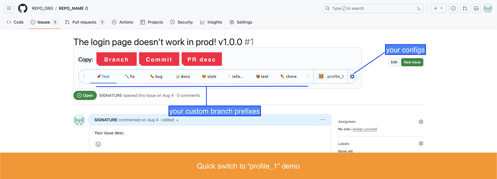
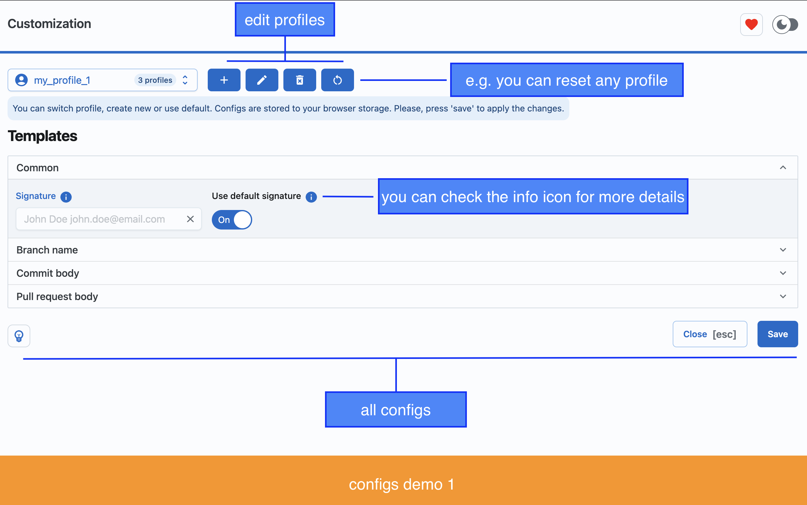
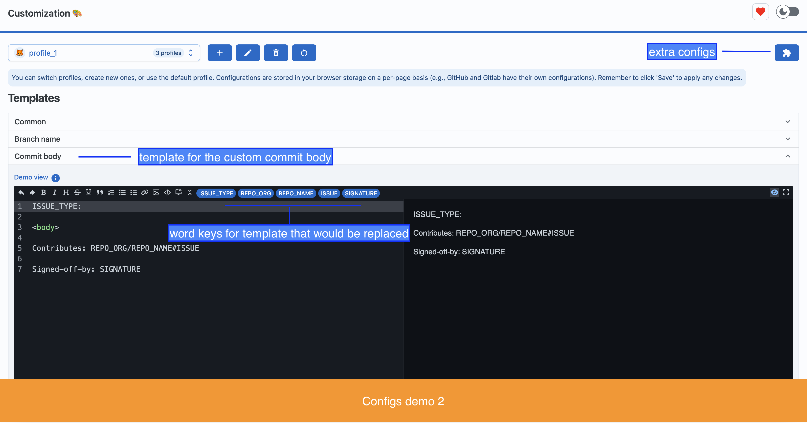
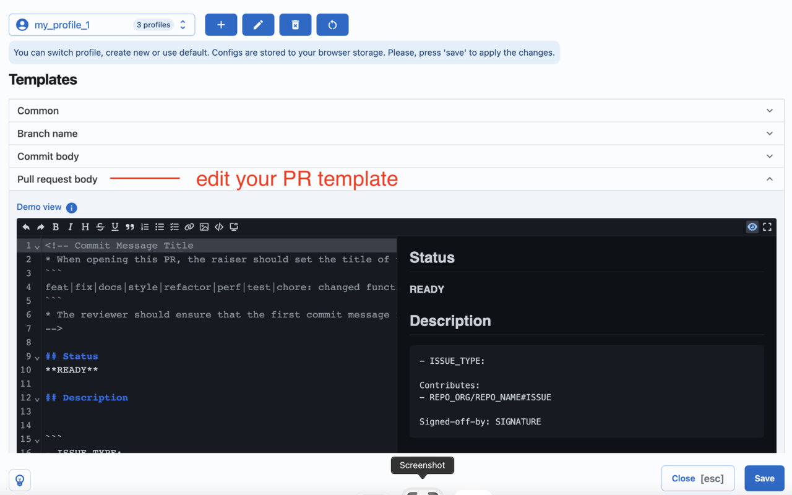

# Projects

👋 Hey!

My free projects:

-  `Faster PR`: speed up the process of creating pull requests on `GitHub`, `GitLab(gitlab.com)` **only** with a plugin that automatically generates branch names, commits, and PR descriptions in just one or two clicks. Additionally, this plugin can be customized to use your own templates. The plugin is shown in issue and pull request pages. Published: ,  

  
Demo

      
      
      
      
    
  

- TBC 📝

[Is there something that should be improved/fixed or have a question?](https://github.com/StellarExplorerGuy/projects/issues/new/choose)

## Become a Sponsor ❤️

> https://ko-fi.com/stellarexplorerguy

Whenever I receive a tip, it creates an impact! It's not just about the financial support, it also boosts my confidence to share more projects!

Much appreciated! 🙌

  

